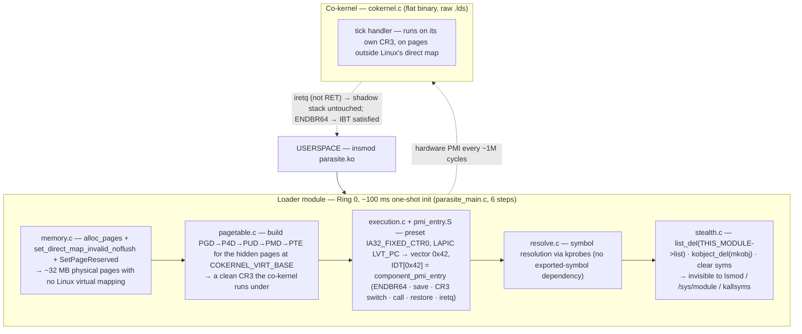

# CoKernel — a parallel co-kernel PoC for Linux x86-64

**Proof of concept**: an independent execution component — a "co-kernel" — that coexists
with a running Linux kernel inside a QEMU x86-64 VM, aiming for *invisibility across three
surfaces*: **memory** (pages removed from Linux's direct map), **execution** (driven by a
hardware PMI on the PMU, no kernel function hooked, no text patched), and **behaviour**
(the loader module self-hides from `lsmod` / sysfs / kallsyms), while staying compatible
with CET (IBT + shadow stack).

[]()
[]()
[]()
[](LICENSE)

> ## ⚠️ Research / authorized lab use only
> This is offensive-security / OS-internals **research**. It loads an unsigned kernel
> module that manipulates page tables, the IDT and the PMU, and hides itself — run it
> **only inside a throwaway QEMU VM you control**, never on a machine you care about or
> don't own. No exploit, no persistence mechanism beyond the PoC, no targets included.
> Provided as-is for learning how stealth-execution techniques work (and therefore how to
> detect them — see *Residual traces* below).

## Architecture



## Repository layout

```text
Makefile                top-level build orchestrator
include/shared.h         shared definitions (memory layout, constants)
cokernel/                the co-kernel payload — cokernel.c/.h, cokernel.lds (flat binary), Makefile
module/                  the loader (out-of-tree Kbuild module):
                           parasite_main.c (orchestrator) · memory.c/.h · pagetable.c/.h ·
                           execution.c/.h · resolve.c/.h · stealth.c/.h · pmi_entry.S · ck_reader.c · Makefile
scripts/                 build_module.sh · build_rootfs.sh (busybox initramfs) · config.sh · run_qemu.sh
markdown/                design doc (V0) + per-version notes (V1–V3) + Roadmap
```

> Build artifacts (`*.o`, `*.ko`, `*.mod*`, `.*.cmd`, `Module.symvers`, `cokernel.bin/.elf`,
> the generated `module/cokernel_blob.h`, `build/`) are not tracked — they're produced by `make`.

## Prerequisites

Debian/Ubuntu x86-64 host with the headers for the running kernel:

```bash
sudo apt-get install -y build-essential gcc make libelf-dev libssl-dev \
    linux-headers-$(uname -r) qemu-system-x86 wget cpio xxd gzip
```

## Build & run

```bash
make all          # build the co-kernel binary + parasite.ko, then the busybox initramfs
make run          # launch QEMU with the host kernel (/boot/vmlinuz-$(uname -r))
# step by step: make module ; make rootfs ; make run
# debug:        make run -- -s -S   (then gdb → target remote :1234)
# exit QEMU:    Ctrl-A X   (or `poweroff -f` inside)
```

Inside the VM the init script: shows the pre-load state → `insmod parasite.ko` → shows the
post-load state (the module should be gone) → runs the verification script → drops to a
shell. Manual checks: `lsmod`, `cat /proc/modules`, `ls /sys/module/`, `cat /proc/iomem`,
`cat /proc/vmallocinfo`, `dmesg | grep cokernel`.

## How it works (short)

1. **Invisible memory** — `alloc_pages` a contiguous block, `set_direct_map_invalid_noflush`
   it out of `ffff888…`, flush TLB, `SetPageReserved` so the buddy allocator won't reclaim it.
2. **Custom page tables** — a full PGD→PTE hierarchy mapping those pages at
   `COKERNEL_VIRT_BASE`; the PMI handler loads that PGD into CR3.
3. **Hardware execution** — `IA32_FIXED_CTR0` overflows after ~1M cycles → PMI → LAPIC
   delivers vector `0x42` → `IDT[0x42]` is the handler. No function hooked, no text patched.
4. **Self-hiding** — unlink from the module list, drop the kobject, clear the symbol table.
5. **CET-friendly** — handler starts with `ENDBR64` (IBT), ends with `iretq` (shadow stack
   never consulted).

## Residual traces (so you know what *would* detect it)

| Trace | Detectable by | Risk |
|---|---|---|
| `IDT[0x42]` modified | full IDT scan | low |
| PMU MSRs modified | `rdmsr` / `perf stat` | very low |
| ~32 MB "used" in `MemFree` | `/proc/meminfo` | none (indistinguishable) |
| `PageReserved` struct pages | exhaustive vmemmap scan | very low |

## Status

PoC. Runs in a QEMU x86-64 VM with KVM. Versioned design notes in `markdown/` (V0 design
doc → V1–V3 + Roadmap).

## License

[GPL-2.0](LICENSE) — Linux kernel module; research/educational purposes only.

---

<sub>Part of my work — more at <a href="https://zz0r0.fr">zz0r0.fr</a>.</sub>
